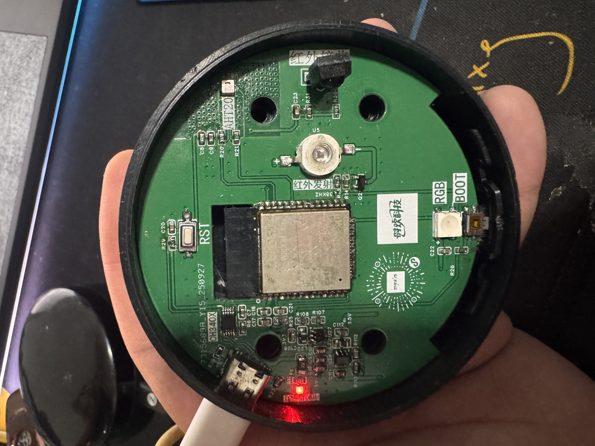
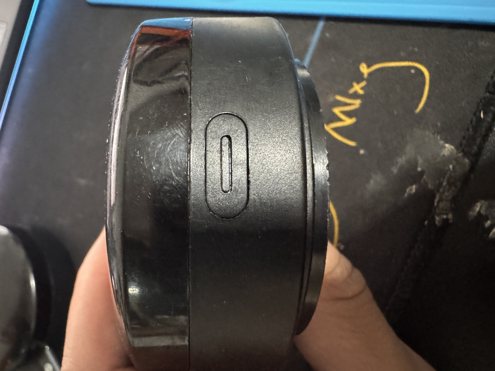
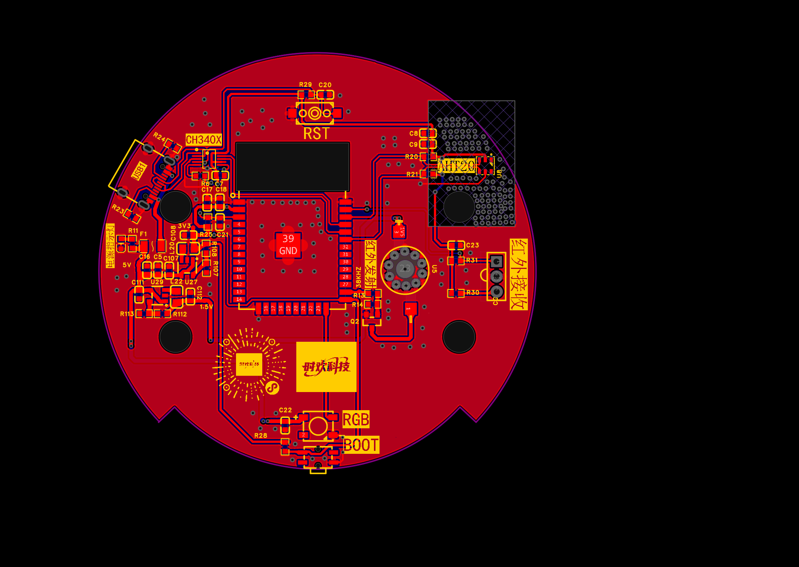
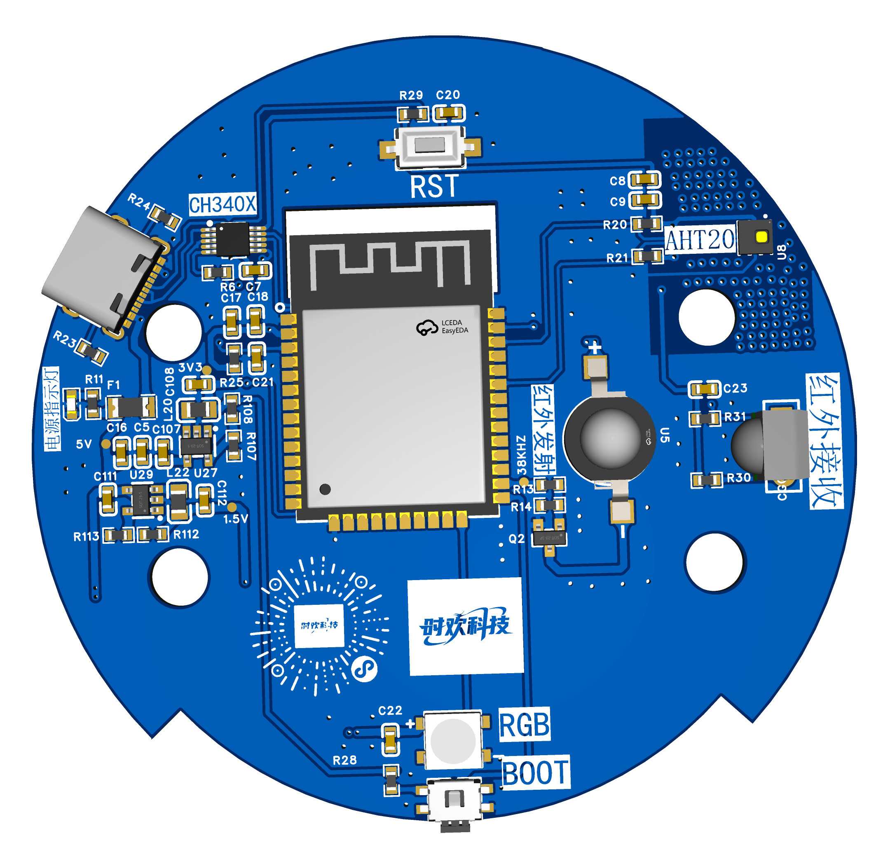
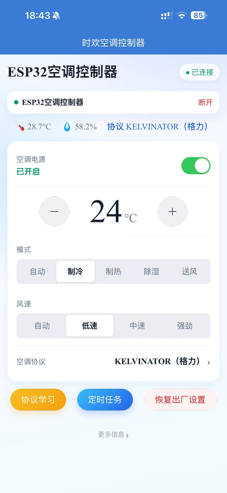
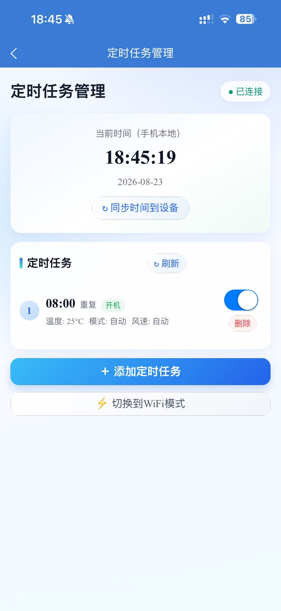
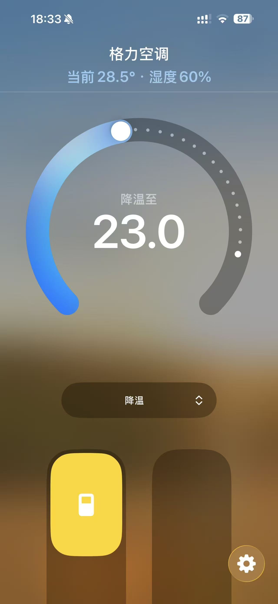

# ESP32 空调红外控制器

一个开源的 **ESP32 智能空调红外控制器**：手机 App 通过蓝牙（BLE）直接控制空调，苹果版固件额外支持 **HomeKit**，可以用「家庭」App 和 Siri 语音控制。支持定时任务、协议学习、温湿度监测，一套代码同时支持 **Android / iOS / 微信小程序**。

> 项目持续迭代中，欢迎 Star ⭐ 和 Issues 交流。

## 功能特性

| 功能 | 说明 |
|------|------|
| 📱 三端 App | uni-app 一套代码，支持 Android / iOS / 微信小程序 |
| 📶 双控制模式 | BLE 直连（无需 WiFi）+ HomeKit（苹果版，支持 Siri） |
| ⏰ 定时任务 | 设备本地存储执行，连接 App 自动校时，掉电不丢失 |
| 🎯 协议学习 | 对准空调遥控器按键，自动识别并保存空调协议 |
| 🌡️ 温湿度监测 | AHT20 传感器，App 实时显示环境温湿度 |
| 💡 RGB 状态灯 | 蓝/青/绿/紫/红/黄/白 8 种状态，工作状态一目了然 |
| 🔄 恢复出厂 | 长按 BOOT 键 3 秒，或 App 一键重置（清配对/定时/协议） |

## 快速开始

### 1. 烧录固件

需要安装 [PlatformIO](https://platformio.org/)（VS Code + PlatformIO 插件即可）：

```bash
# 苹果版（HomeKit + WiFi + BLE）
pio run -e esp32dev -t upload

# 安卓版（纯 BLE，无 WiFi）
pio run -e esp32_ble -t upload
```

### 2. 安装 App

用 [HBuilderX](https://www.dcloud.io/hbuilderx.html) 打开 `wechat-miniprogram/app`，运行到手机或云打包成 Android/iOS 安装包。

### 3. 连接使用

1. 打开 App，扫描并连接设备（BLE 广播名 `ESP32-AC`）
2. 连接后 App 会自动给设备校时
3. 选择协议：国内常见品牌可直接对照选择（见下表），或使用「协议学习」对准遥控器自动识别
4. 苹果版：在「家庭」App 中添加配件，配对码 `11122333`，即可用 Siri 控制

## 国内品牌协议对照

| 品牌 | 协议 |
|------|------|
| 格力 | KELVINATOR |
| 美的 | COOLIX |
| 海尔 | HAIER_AC / HAIER_AC_YRW02 |

> 不确定型号时，建议用 App 里的「协议学习」自动识别。

## 硬件清单与接线

| 硬件 | 说明 |
|------|------|
| ESP32 开发板 | 推荐 8MB Flash（如 ESP32-WROOM-32） |
| 红外发射管 | GPIO4 |
| 红外接收头 | GPIO23 |
| AHT20 | I2C 温湿度传感器 |
| WS2812B RGB LED | GPIO2，状态指示灯 |
| BOOT 按键 | GPIO0，短按切换 BLE/WiFi，长按 3 秒恢复出厂 |

> 引脚定义见 `src/main.cpp` / `src/LedManager.h`，可按实际硬件调整。

## 仓库结构

```
├── src/                  # ESP32 固件（PlatformIO，Arduino 框架）
│   ├── main.cpp          # 主程序、HomeKit、模式切换
│   ├── BleManager.*      # BLE 通信（Nordic UART）
│   ├── IrManager.*       # 红外发射（独立任务运行在核心 1）
│   ├── WifiManagerEx.*   # WiFi / 配网 / Web 服务
│   ├── TimerManager.*    # 定时任务
│   ├── SensorManager.*   # AHT20 温湿度
│   └── LedManager.*      # RGB 状态灯
├── wechat-miniprogram/
│   └── app/              # 双端 App（uni-app，HBuilderX）
└── *.md                  # 项目文档
```

## 固件版本说明

| 环境 | 适用平台 | 说明 |
|------|----------|------|
| `esp32dev` | 苹果版 | HomeKit + WiFi + BLE，功能完整 |
| `esp32_ble` | 安卓版 | 纯 BLE，体积小、更省电，无 WiFi/HomeKit |

## 技术要点

- 基于 [IRremoteESP8266](https://github.com/crankyoldgit/IRremoteESP8266)（2.8.6）实现几十种空调协议收发
- 基于 [HomeSpan](https://github.com/HomeSpan/HomeSpan)（1.9.1）实现 HomeKit 配件
- 红外发射放在**核心 1 的独立 FreeRTOS 任务**中，避免与 BLE/WiFi 争抢 CPU 导致红外时序错误
- BLE 采用 Nordic UART 服务，明文文本命令协议，详见通信协议文档

## 文档

- [微信小程序BLE通信协议.md](微信小程序BLE通信协议.md) — BLE 指令协议
- [LED状态说明.md](LED状态说明.md) — 状态灯颜色含义
- [PLATFORMIO_TIPS.md](PLATFORMIO_TIPS.md) — PlatformIO 使用技巧
- [项目问题总结.md](项目问题总结.md) — 开发过程踩坑记录

## 效果预览

**设备实物**



**外壳**



**PCB 与 3D 盒体**

 | 

**App 控制界面**

 | 

**HomeKit 家庭 App**



## License

仅供学习交流使用。
